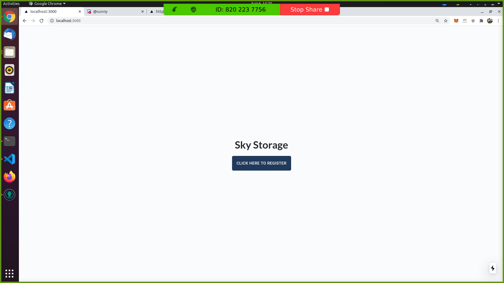
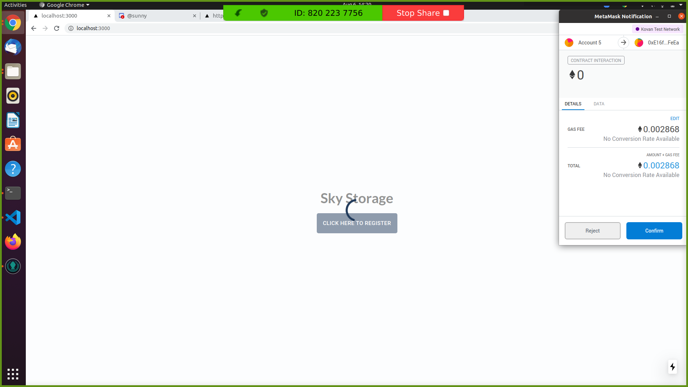
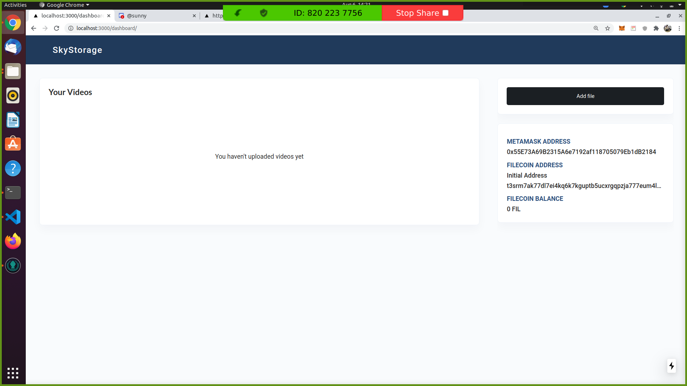
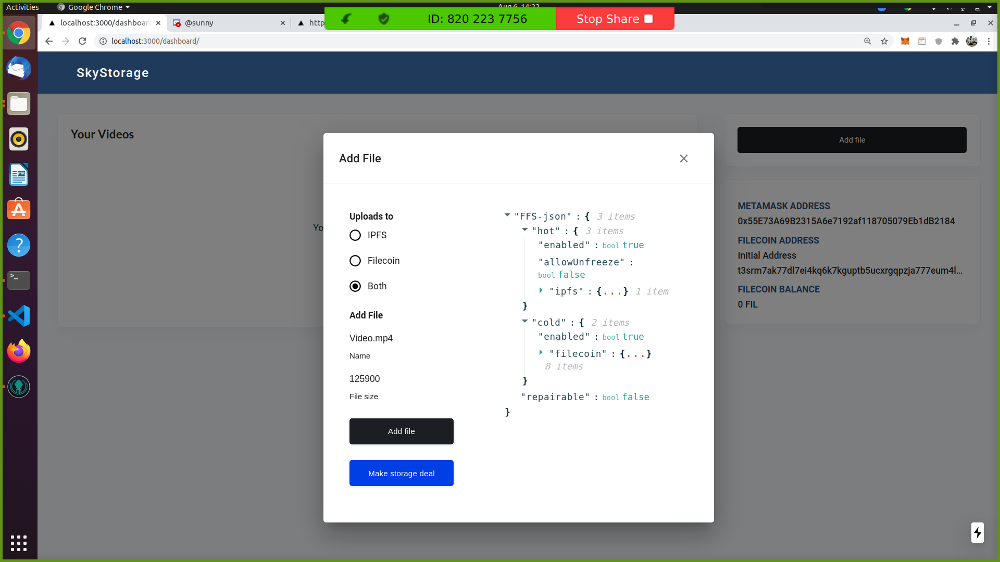
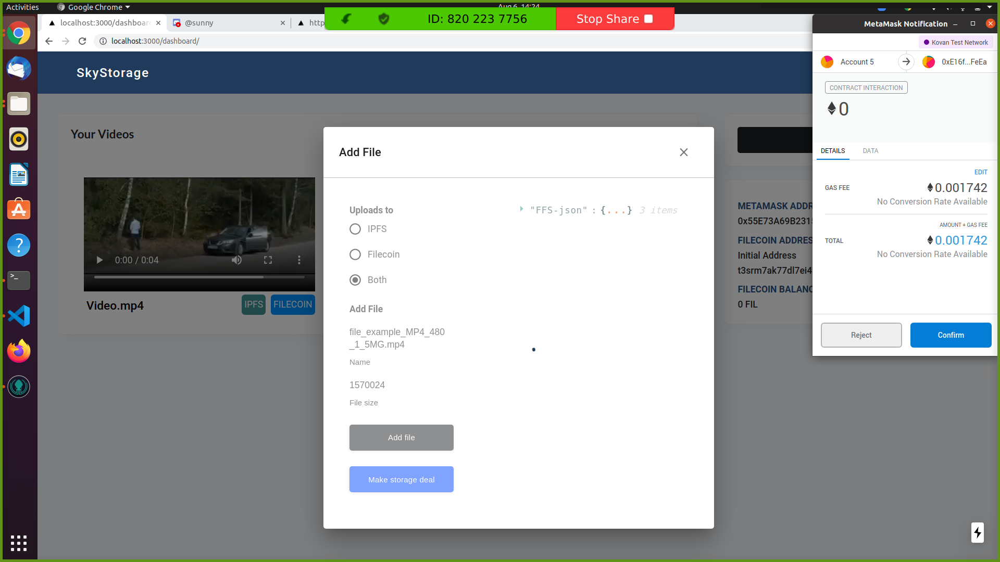
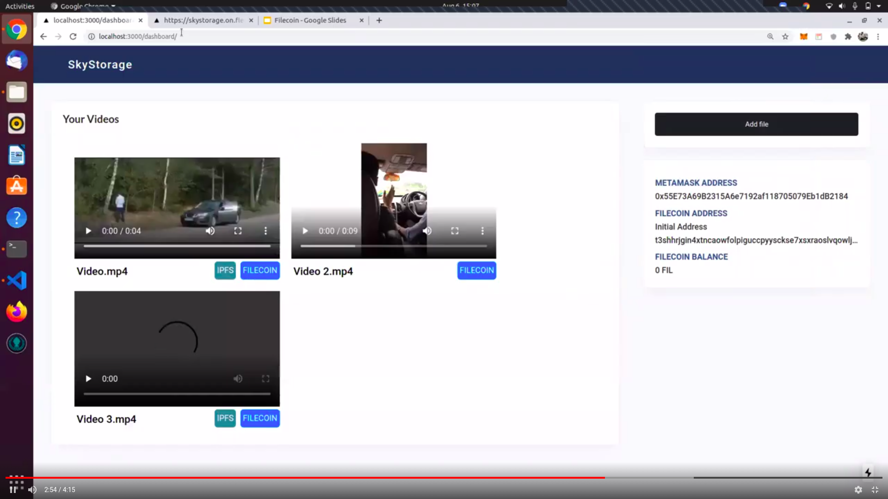

# Decentralized-Media - (Filecoin & IPFS & PowerGate)

Decentralized-Media is a decentralized video player. Where user can upload video on web3 platforms like Filecoin and IPFS.   
Platform will give ability to users for change the storage config of individual video file(like change in, hot and cold storage).    
Decentralized-Media will retrieve only uploaded videos by login users. And give accessibilty on this video files as a video player on the platform.  
Even, The platform storing the video file details on ethereum blockchain.  
Decentralized-Media is hosted on fleek.co hosting service.

## Screenhots

### 1. Decentralized-Media Landing Page with register 


### 2. Use will register here
    - Once user press to register, Pltform create new filecoin token and filecoin address for new user metamask address.
    - Filecoin token will map to that metamask address and no need to register again for that metamask address


### 3. Dashboard
    - Once user register, user can see dashboard with empty video list
    - Right side you can see metamask address and filecoin address details and Add file features to filecoin or IPFS.


### 4. After press Add File,
    - After selecting file you can see Storage config.
    - User can modify changes. Like where exactly user wants to store video file(Filecoin, IPFS or BOTH)


### 5. After selecting Both,
    - After selecting Both(IPFS and Filecoin), You can see config change as per selecting.
    - Then user will press make storage deal.
    - Once storage deal confirm, platform will store video file details into Ethereum samrt contract to retrirve data in dashboard. 


### 6. Dashboard with video Gridview


## How to run and use for devs?

```note:  You must have Linux system to setup```

- Run localnet on your on machine  
1). `Open New Terminal`  
1). `git clone git@github.com:textileio/powergate.git`  
2). `cd powergate/docker`  
3). `BIGSECTORS=true make localnet`  

- Run Dapp on localhost  
1). clone repo `https://github.com/sunnyRK/Decentralized-Media.git`  
2). `cd Decentralized-Media`  
3). Install dependencies for dapp `npm install`   
4).Run Dapp `node server.js`  
5). Go to `http://localhost:8000`    

## Tech Stack We are using

  - Filecoin-IPFS
  - Textile Powergate - To interact with Filecoin and IPFS
  - Ethereum (ETH+IPFS concept to save file details)
  - Fleek.Co to Host Website
  - Next.Js and Material UI For Frontend

## Contacts

`radadiyasunny970@gmail.com`  
[Twitter](https://twitter.com/RadadiyaSunny)
